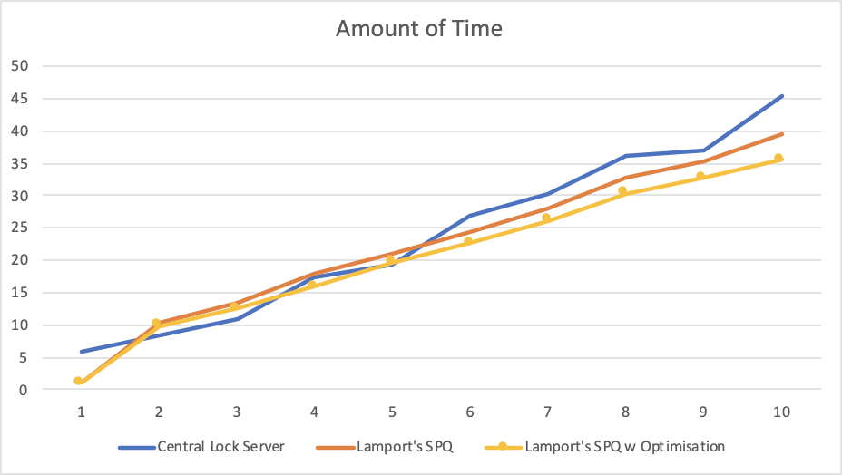

All timings are in seconds

Assumptions:
- To simulate asynchronous and stochastic nature of RTTs, each message is sent with a delay time of 2 - 3 seconds. 
- Each message received has a simulated latency of 0.05 seconds. 
- The critical section work takes 1 seconds to complete

| Number of Nodes | Central Lock Server | Lamport's SPQ | Lamport's SPQ w Optimisation |
| --------------- | ------------------- | ------------- | ---------------------------- |
| 1               | 5.82                | 1             | 1.01                         |
| 2               | 8.4                 | 10.49         | 9.84                         |
| 3               | 10.99               | 13.52         | 12.59                        |
| 4               | 17.42               | 17.83         | 15.91                        |
| 5               | 19.32               | 20.97         | 19.69                        |
| 6               | 26.94               | 24.25         | 22.58                        |
| 7               | 30.35               | 27.92         | 26.17                        |
| 8               | 36.07               | 32.73         | 30.34                        |
| 9               | 36.91               | 35.4          | 32.78                        |
| 10              | 45.31               | 39.42         | 35.51                        |

